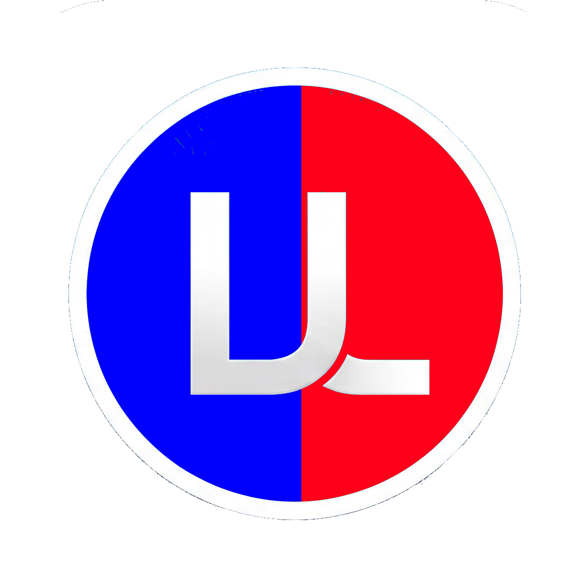

<table border="0">
  <tr>
    <td>
      <!-- VERSION -->v6.07.09<br>
      <!-- DATE -->09-Jul-2026<br>
      macOS &nbsp;|&nbsp; Windows &nbsp;|&nbsp; Linux<br>
      <a href="https://landenlabs.com">Home</a>
    </td>
    <td>
      <a href="https://landenlabs.com">
        
      </a>
    </td>
  </tr>
</table>



# Compare Tool

A side-by-side text comparison tool with LCS-based auto-alignment, color-coded rows,
word-level diff highlighting, and synchronized scrolling.

**By [LanDen Labs](https://github.com/landenlabs) (2026)**

---

## Screenshots

_(coming soon)_

---

## Features

- **LCS-based auto-alignment.** Uses Python's `difflib` to align left and right panels
  so matching lines sit on the same row; blank rows are inserted where lines differ.
- **Color-coded rows.**
  - Green — lines match
  - Yellow — both present but differ
  - Red — left side only
  - Blue — right side only
  - Grey — blank padding
- **Word-level diff highlight.** Right-click → Compare on any pair of selected rows to
  overlay orange highlights on the non-matching words in each line.
- **Partial-match highlight.** Toggle in the status bar to show common substrings
  (≥ 3 chars) shared between differing rows.
- **Multi-select rows.** Ctrl+click to toggle individual rows; Shift+click for ranges.
- **Right-click context menu.** Copy, insert, or delete rows — single row or the whole
  selected block, with range-labeled actions (e.g. "Delete rows 20 to 25"). Deleting a
  content row is permanent (removed from the underlying source, so Save/Reset/Auto-Align
  no longer see it); deleting a blank row just removes alignment padding. Cross-panel
  Compare and Sync act on the primary/anchor row.
- **Undo (Ctrl+Z).** Independent per-panel undo history for row deletes and inserts;
  automatically stops recording once a panel's text exceeds a configurable size limit
  (Settings ▸ Appearance ▸ Undo limit), to bound memory use on very large files.
- **Manual shift.** Toolbar buttons shift either panel up or down one blank row at a
  time; the `+`/`-` blank-row buttons keep the affected row selected so they can be
  clicked repeatedly.
- **Synchronized scrolling.** Both panels scroll together; independent horizontal scroll.
- **Regex key extraction.** Type a regex with capture groups above either panel to
  extract the comparison key from each line — useful for log files where line numbers
  or timestamps should be ignored during alignment.
- **Sort.** Sort both panels' lines (using the regex key if set) before aligning.
- **Jump to diff.** Next Diff / Prev Diff buttons (Ctrl+N / Ctrl+Shift+N) jump to the
  next or previous non-matching row.
- **Paste text.** Load text without a file via the panel title menu → Paste Text.
- **Save As.** Defaults to the file's original path/name, and includes any inserted
  blank rows in the saved output.
- **Font zoom.** `+` / `−` buttons in the status bar scale the font from 50% to 200%.
- **Appearance settings.** Choose font family, size, bold, row height, and the undo
  size limit; persisted via QSettings across runs.
- **Match statistics.** Status bar shows matched/total rows and a breakdown of
  different, left-only, and right-only counts.

---

## Requirements

- Python 3.9 or later
- PyQt6

```bash
pip install -r requirements.txt
```

---

## Installation

### Run from source

```bash
git clone https://github.com/landenlabs/compare-text.git
cd compare-text
python compare-text6.py --help
```

### Build a standalone binary

**macOS / Linux**

```bash
pyinstaller --onefile --name compare-text compare-text6.py
```

**Windows**

```powershell
pyinstaller --onefile --name compare-text compare-text6.py
```

Both commands use [PyInstaller](https://pyinstaller.org) to produce a self-contained executable.

Pushing a `v*` tag (e.g. `v1.0.0`) triggers `.github/workflows/build.yml`, which builds
macOS and Windows binaries and publishes them to a GitHub Release automatically.

---

## Usage

### Compare two files

```bash
python compare-text6.py left.txt right.txt

# Sort both files before aligning
python compare-text6.py --sort left.txt right.txt
```

### Compare interactively

```bash
python compare-text6.py
```

Click the panel title to open a file or paste text. Press **Auto-Align** (Ctrl+A) to
run LCS alignment after loading both sides.

### Sample output

```
  Line  Left panel                 Right panel
  ----  -------------------------  -------------------------
    1   (green) apple              (green) apple
    2   (yellow) bananaa           (yellow) banana
    3   (red)  cherry              (blank)
    4   (blank)                    (blue)  date
```

### Key shortcuts

| Shortcut | Action |
| -------- | ------ |
| `Ctrl+A` | Auto-Align (LCS) |
| `Ctrl+S` | Sort both panels |
| `Ctrl+N` | Jump to next difference |
| `Ctrl+Shift+N` | Jump to previous difference |
| `Ctrl+Z` | Undo last row delete/insert on the last-focused panel |
| `Ctrl+L` | Open left file |
| `Ctrl+R` | Open right file |
| `Ctrl+,` | Open Settings |
| `Ctrl+Up` | Shift left panel up |
| `Ctrl+Down` | Shift left panel down |
| `Alt+Up` | Shift right panel up |
| `Alt+Down` | Shift right panel down |

---

## Project structure

```
compare-text/
├── compare-text6.py             # Main script (GUI application)
├── version.py                   # Version string (__version__)
├── VERSION                      # Bare X.Y.Z, mirrors version.py
├── set-version.bash             # Bump version, commit, tag, push (macOS/Linux)
├── set-version.ps1              # Bump version, commit, tag, push (Windows)
├── icon.png                     # App icon: title bar, taskbar, About dialog, README
├── icon.icns                    # App icon baked into the macOS release build
├── icon.ico                     # App icon baked into the Windows release build
├── make-icons.py                # Regenerate icon.icns/icon.ico from icon.png
├── requirements.txt
├── README.md
├── LICENSE
├── screens/                     # Images used in this README + the About dialog animation
└── .github/workflows/build.yml  # Tag-triggered build + GitHub Release
```

---

## Releasing

Versions are bumped with `set-version.bash` (or `set-version.ps1` on Windows), run from
the repo root:

```bash
./set-version.bash -version 1.0.1 -message "Fix LCS alignment on tab-only lines"
```

This updates `VERSION`, `version.py` (`__version__`), and the `<!-- VERSION -->` /
`<!-- DATE -->` markers at the top of this README, then commits, tags, and pushes. The
pushed `vX.Y.Z` tag triggers the release build above. The in-app "Built" date (Settings ▸
About) is derived from `version.py`'s file timestamp, so it tracks the last version bump.

---

## License

Apache 2.0 © [LanDen Labs](https://github.com/landenlabs) 2026
